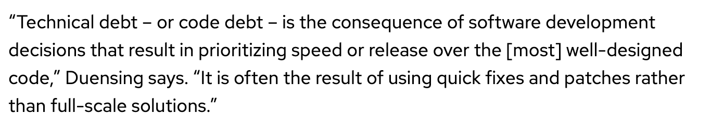

* Investing some thought in design of software makes it possible to maintain\, reuse and extend it
* Even if some research software begins its life as a one\-off use case\, it often gets reused
  * Without proper design it is likely to accrete features haphazardly and become a monstrosity
    * Acquires a lot of technical debt in the process
  * Many projects have had this happen
  * Most end up with a hard reset and start over again
* In this module we will cover general design principles and those that are tailored for scientific software
* We will also work through two use cases

definition from https://enterprisersproject\.com/article/2020/6/technical\-debt\-explained\-plain\-english

