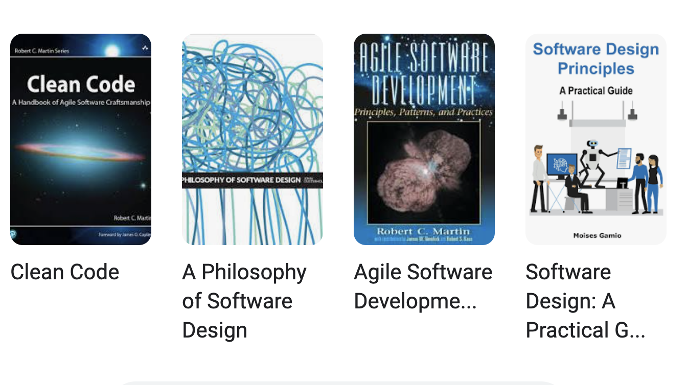

* Investing some thought in design of software makes it possible to maintain\, reuse and extend it
* Even if some research software begins its life as a one\-off use case\, it often gets reused
  * Without proper design it is likely to accrete features haphazardly and become a monstrosity
    * Acquires a lot of technical debt in the process
  * Many projects have had this happen
  * Most end up with a hard reset and start over again
* In this module we will cover general design principles and those that are tailored for scientific software
* We will also work through two use cases

definition from https://enterprisersproject\.com/article/2020/6/technical\-debt\-explained\-plain\-english

# Books on the Topic

So why

this module?

…\. and many more

# Motivation and Objectives

* The same reason as for taking other courses even when they have good textbooks
  * A practitioner with experience can make the ideas more accessible
  * Instructor can perceive when attendees are not following
    * Can try to present the same idea with a different approach and/or perspective
    * Works only when students are engaged and interacting –  _so please interact \!_
* Research software needs some tweaks and additions
  * Some challenges are unique to RS\, not covered in the literature
  * Sometimes straight adoption of principles can be counterproductive

