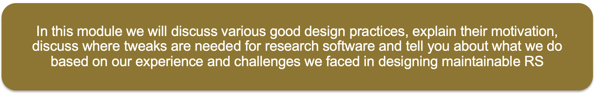

# Why Design

* Investing some thought in design of software makes it possible to maintain\, reuse and extend it
* Even if some research software (RS) begins its life as a one\-off use case\, it often gets reused
* Without proper design it is likely to accrete features haphazardly and become a monstrosity
* Acquires a lot of technical debt in the process

definition from
https://enterprisersproject\.com/article/2020/6/technical\-debt\-explained\-plain\-english

In many ways technical debt works like monetary debt. If you don't pay
it off it compounds. The more technical debt you accrue, the more
unmaintainable your software becomes. 

Many projects have had this happen to them, and most of them end up
with a hard reset and having to start over again

#  In this module we will cover general design principles and those that are tailored for scientific software

Several books are available on the topic of software design

…\. and many more

So why do we have this module in the bootcamp ?

# Motivation and Objectives

The first and foremost reason is the same as for taking any course
that has good textbooks.

A practitioner with experience can make the ideas more
accessible. Instructor can perceive when attendees are not following
and therefore can try to present the same idea with a different
approach and/or perspective. Practitioners also bring their own
intuition and experience to the discussion which tend to enrich the
information being imparted in a classroom setting.

There are other reasons why software design needs to be included in a
research software engineering training. Most of software engineering
research and literature targets enterprise software that is in
production. Literature is sparse even for exploratory enterprise
software. One reason is that understanding the requirements and
devising strategies for design of exploratory software is
difficult. For industry it may not even be a worthwhile expenditure
because before being released and utilized for production all software
likely goes through rigorous quality control. 

Research software in academic setting is different because it is also
the production software. Often exploration and production go hand in
hand, which means that quality control is an ongoing
process. Therefore it is important to understand methodologies for
designing research software that meets research goals while
maintaining its reliability without becoming an excessive burden on
the developers and the users.

