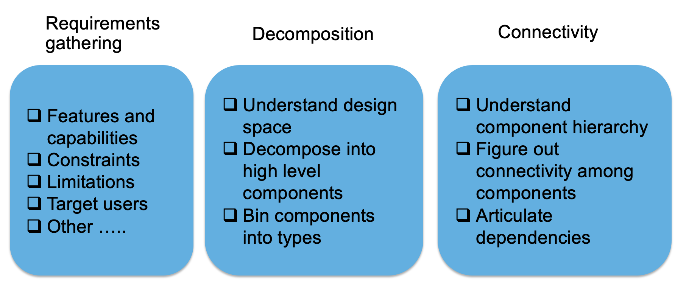

# General Design Principles

## Found on the web
* Encapsulate what varies
* Favor composition over inheritance
* Program to interfaces not implementations
* Loose coupling – interacting components should have minimal knowledge about each other
* SOLID
  * Single responsibility
    * Class/method/function should do only one thing
  * Open/closed
    * Open for extension\, close for modification
  * Liskov substitution
    * Implementations of an interface should give same result
  * Interface segregation
    * Client should not have to use methods it does not need
  * Dependency inversion
    * High level modules should not depend on low level modules\, only on abstractions

# Designing Software – High Level Phases

