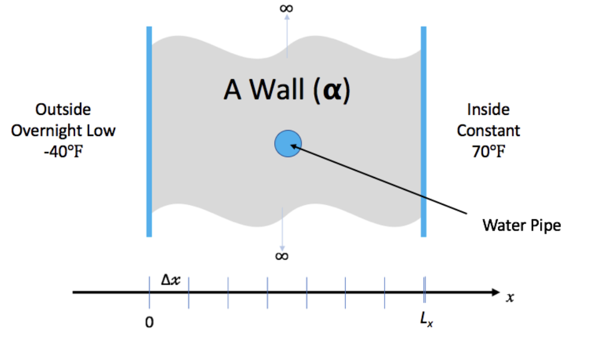
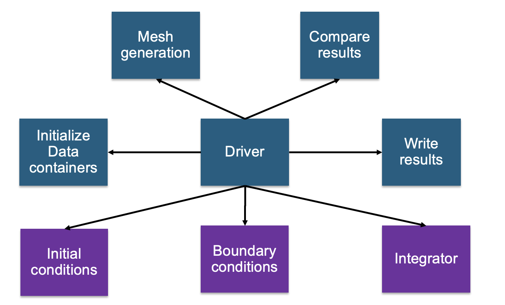
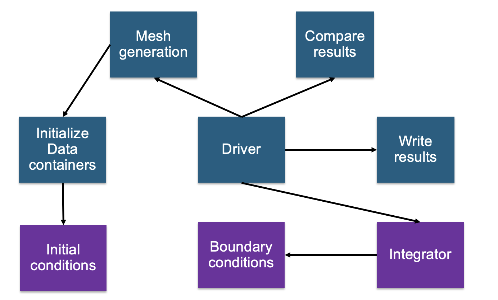

# Example 1 – Problem Description

We have a house with exterior walls made of single material of thickness Lx

The wall has some water pipes shown in the picture\.

The inside temperature is kept at 70 degrees\. But outside temperature is expected to be \-40 degrees for 15\.5 hours\.

Will the pipes freeze before the storm is over

In general, heat [conduction](https://en.wikipedia.org/wiki/Thermal_conduction) is governed
by the partial differential (PDE)...

| | |
|:---:|:---:|
||(1)|

where _u_ is the temperature at spatial positions, _x_, and times, _t_,
 is the _thermal diffusivity_
of the homogeneous material through which heat is flowing. This partial differential equation (PDE)
is known as the _Diffusion Equation_ and also the [_Heat Equation_](https://en.wikipedia.org/wiki/Heat_equation).

# Simplifying Assumptions

To make the problem tractable for this lesson, we make some simplifying assumptions...

1. The thermal diffusivity, ,
   is constant for all _space_ and _time_.
1. The only heat _source_ is from the initial and/or boundary conditions.
1. We will deal only with the _one dimensional_ problem in _Cartesian
coordinates_.

In this case, the PDE our application needs to solve simplifies to...

| | |
|:---:|:---:|
||(2)|

The code in the repository has three different numerical algorithms

* [Foward Time Centered Space (FTCS)](https://en.wikipedia.org/wiki/FTCS_scheme), an
[explicit](https://en.wikipedia.org/wiki/Explicit_and_implicit_methods) method
* [Crank-Nicholson](https://en.wikipedia.org/wiki/Crank–Nicolson_method),
an [implicit](https://en.wikipedia.org/wiki/Explicit_and_implicit_methods) method
* [Upwind-15](https://en.wikipedia.org/wiki/Upwind_scheme), another
[explicit](https://en.wikipedia.org/wiki/Explicit_and_implicit_methods) method
with higher spatial order than FTCS.

We will work through one of them -- FTCS

# Requirement gathering

* To solve heat equation we need:
  * a discretization scheme
  * a driver for running and book\-keeping
  * an integration method to evolve solution
  * Initial conditions
  * Boundary conditions
* To make sure that we are doing it correctly we need:
  * Ways to inspect the results
  * Ways of verification

# Decomposition

* This is a small design space
* Several requirements can directly map to components – in this instance functions
  * Driver
  * Initialization – data containers
  * Mesh initialization – applying initial conditions
  * Integrator
  * I/O
  * Boundary conditions
  * Comparison utility

* Binning components
* Components that will work for any application of heat equation
  * Driver
  * Initialization – data containers
  * I/O
  * Comparison utility
* Components that are application specific
  * Mesh initialization – applying initial conditions
  * Integrator
  * Boundary conditions

# Connectivity

# Connectivity – Alternative Possibility

