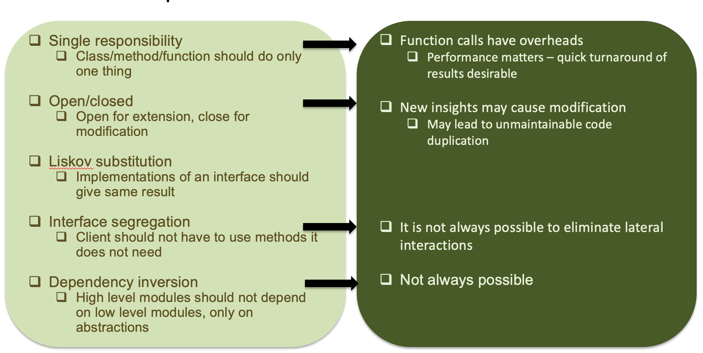
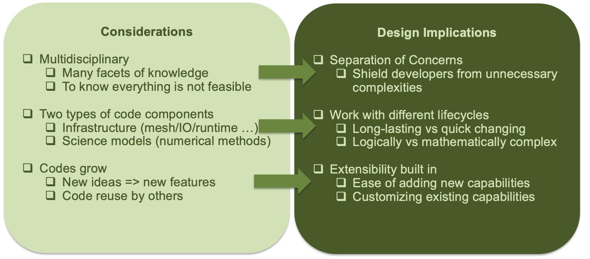

# Research Software Specific Challenges

Many parts of the model and software system can be under research

Requirements change throughout the lifecycle as knowledge grows

Verification complicated by floating point representation

Real world is messy

# SOLID Principles Pose Some Difficulties

# Additional Considerations for Research Software

