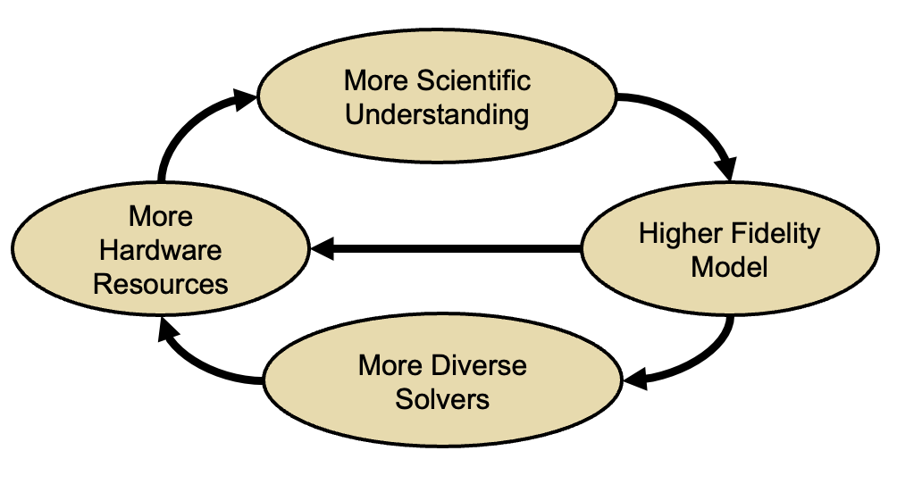

# Research Software Specific Challenges

For most of research software we have a positive feedback loop. When
we start exploring some phenomenon we devise a mathematical model for
it. In the initial stages one typically focuses on one or two most
accessible aspects of the problem. So one makes simplifying
assumptions. As understanding grows one starts to relax the
simplifying assumptions and the model grows more complex. A more
complex problem will usually need more complex software and more
hardware resources. The more complex problem will in turn lead to
greater understanding ... and thus the positive feedback loop
persists.

This process leads to several challenges that are unique to RS

* Many parts of the model and software system can be under research
* Requirements change throughout the lifecycle as knowledge grows
* Real world is messy, it does not always yield to easy
componentization
* Connectivity may become very complex
* Access to hardware resources may demand efficiency in computation
  that can be at odds with modularization

An addition challenge is faced by scientific software in that
verification is complicated by floating point representation
# SOLID Principles Pose Some Difficulties

As shown in the figure, some of the SOLID principles do not work too
well with RS. For example the Single Responsibility princple can
become difficult to follow when there is a lot of lateral interaction
become components and computational efficiency demands fusion of
operations. In general greater understanding tends to lead to tighter
coupling among components. Open/closed principle run into problem when
new insights need invasive alteration of either the numerical method
or specific implementation details. To avoid unnecessary code
duplication it may be best to allow modification in the existing
code. Lateral interactions and tight coupling among interfaces can
often make it difficult to segregate interfaces, or to avoid
dependency inversion. 

We will see examples of some of these challengs that 
we work through in the next section 

# Additional Considerations for Research Software

Some additional considerations come into play for designing RS that
may not be needed for enterprise software. These are:

* Many RS projects have interdisciplinary teams, and many different
  types of expertise are needed to put together the whole software. It
  is not possible for all the team members to know all aspects of
  software development. Some understanding of everything is
  necessary for needed interactions, but in-depth knowledge of
  everything is simply not possible. Therefore, the design should permit separation
  of concerns. For example, in a multiphysics simulation software the
  design should be such that the domain scientists can focus on their
  specific physics model and its descretization, applied mathematicians can 
  focus on details of numerical methods and the performance engineers
  can work on optimization.

* In an earlier section about phases of design we had mentioned
  "types" of components and binning them. A base framework that acts
  as the substrate on which capabilities can grow is important for
  most RS. Therefore, one should differentiate between components that
  need to provide that stability, such as the discretization models,
  I/O, book-keeping, and other infrastructural support, and those that
  provide the needed capabilities such as physics models. The number
  of initial interations of the three design phases differ for the
  different component types. The former should be near final in design
  before the latter begin to be embedded in the code. The physics
  components should follow agile methodology much more diligently, and
  be nimble to be able to incorporate new discoveries in the code
  rapidly.

* During design thought should be given to extensibility build into
  the framework and in other components.
