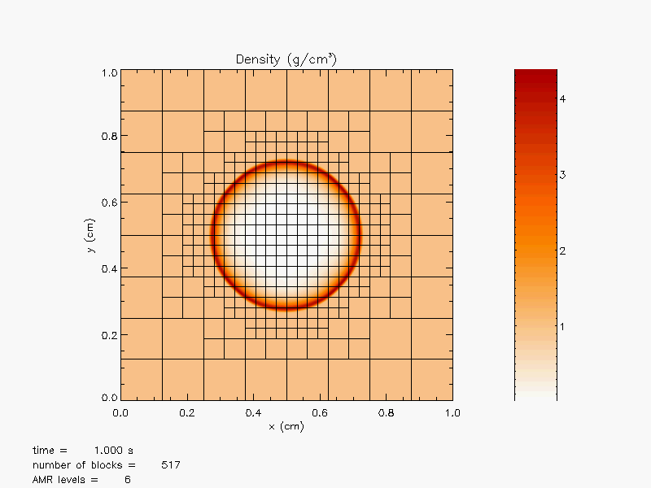
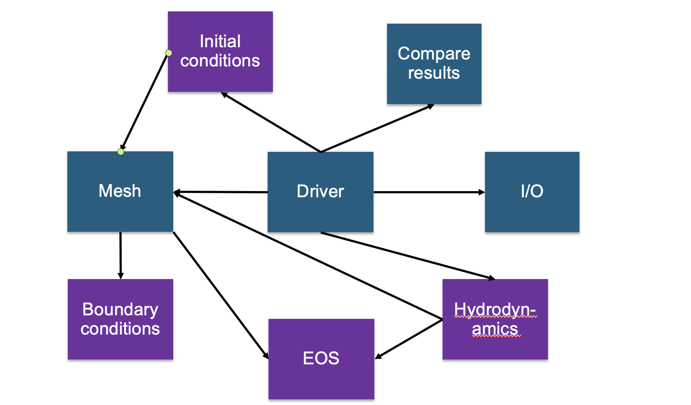
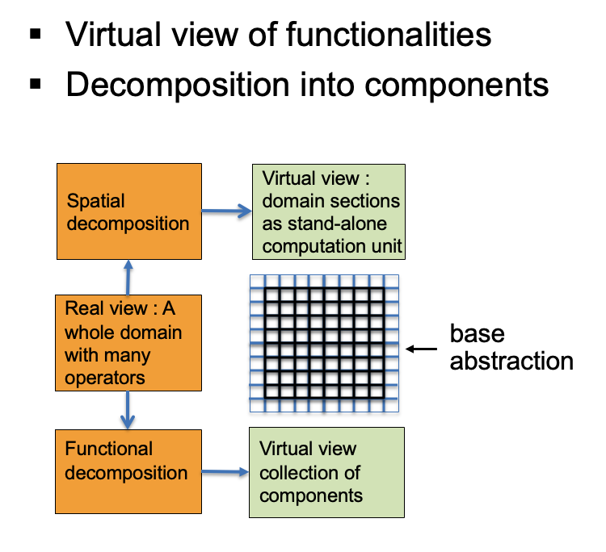
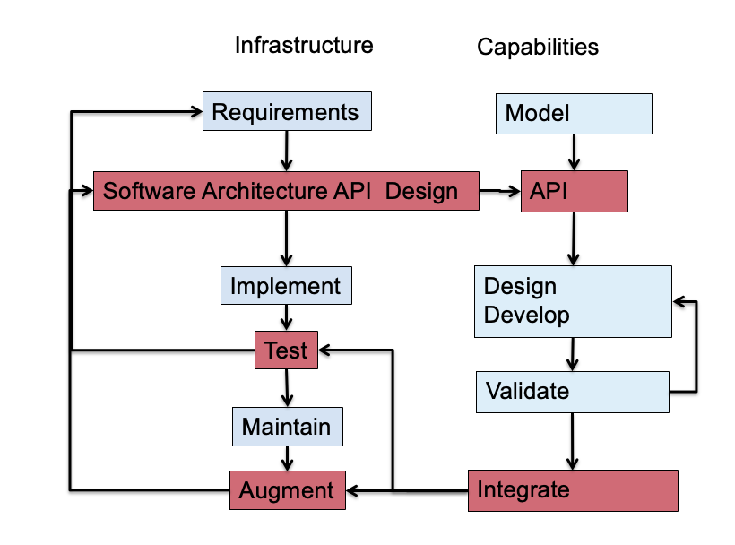
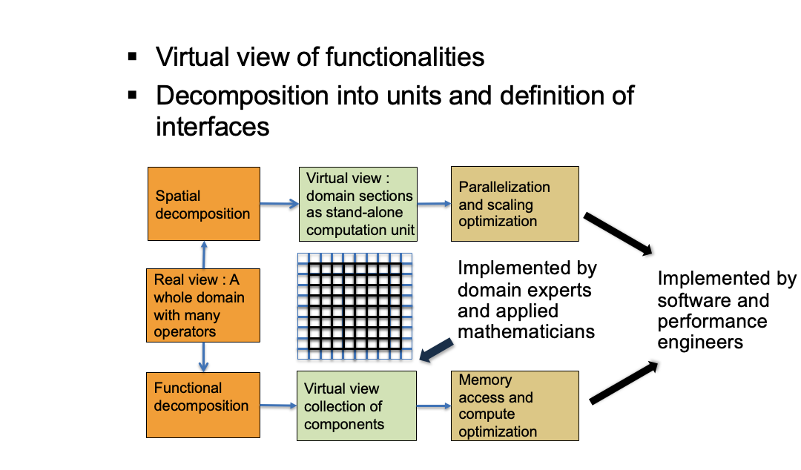

# More Complex Application Design – Sedov Blast Wave

__Description__

Domain is initialized with pressure spike at the center of the domain.
The resulting shock moves out along the radial direction as an
expanding circle in two dimension, or a sphere in three
dimension. High resolution is needed only at and near the shock, so it
is good to use adaptive mesh refinement.

* __Requirements __
* Adaptive mesh refinement
  * Easiest with finite volume methods
* Driver
* I/O
* Initial condition
* Boundary condition
* Shock Hydrodynamics solver
* Ideal gas equation of state
* Method of verification

# Deeper Dive into Requirements

* Adaptive mesh refinement => divide domain into blocks
  * Blocks need halos to be filled with values from neighbors or boundary conditions
    * At fine\-coarse boundaries there is interpolation and restriction
  * Blocks are dynamic\, go in and out of existence
  * Conservation needs reconciliation at fine\-coarse boundaries
* Shock hydrodynamics
  * Solver for Euler’s equations at discontinuities
     * Riemann solver 
  * EOS provides closure
  * Halo cells are fine\-coarse boundaries need EOS after interpolation
* Method of verification
  * An indirect way of checking – shock distance traveled can be computed analytically

# Components

* __Deeper Dive into some Components__
* Driver
  * Iterate over blocks
  * Implement connectivity
* Mesh
  * Data containers
  * Halo cell fill\, including application of boundary conditions
  * Reconciliation of quantities at fine\-coarse block boundaries
  * Remesh when refinement patterns change
* I/O
  * Getting runtime parameters and possibly initial conditions
  * Writing checkpoint and analysis data

* __Binned Components__
* Unchanging or slow changing infrastructure
  * Mesh
  * I/O
  * Driver
  * Comparison utility
* Components evolving with research – physics solvers
  * Initial and boundary conditions
  * Hydrodynamics
  * EOS

# Connectivity

# Exploring design space -- Abstractions

__Constraints__

Only infrastructure components have global view

All physics solvers have block view only

__Other Design Considerations__

Data scoping

Interfaces in the API

Minimal Mesh API

Initialize\_mesh

Halo\_fill

Access\_to\_data\_containers

Reconcile\_fluxes

Regrid

# A Design Model for Separation of Concerns

# Separation of Concerns Applied

# Takeaways So far

Differentiate between slow changing and fast changing components of your code

Understand the requirements of your infrastructure

Implement separation of concerns

Design with portability\, extensibility\, reproducibility and maintainability in mind

