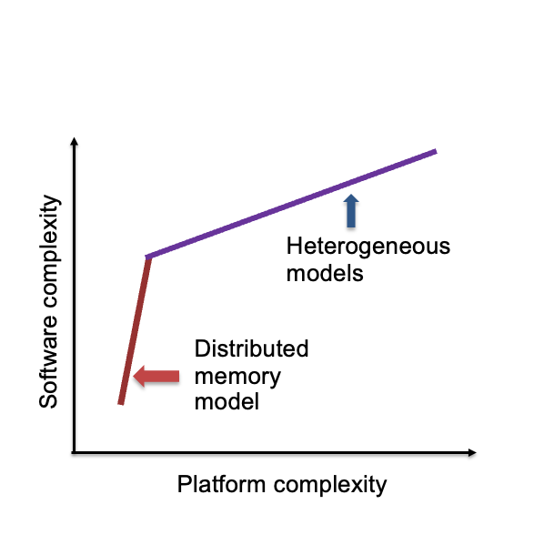
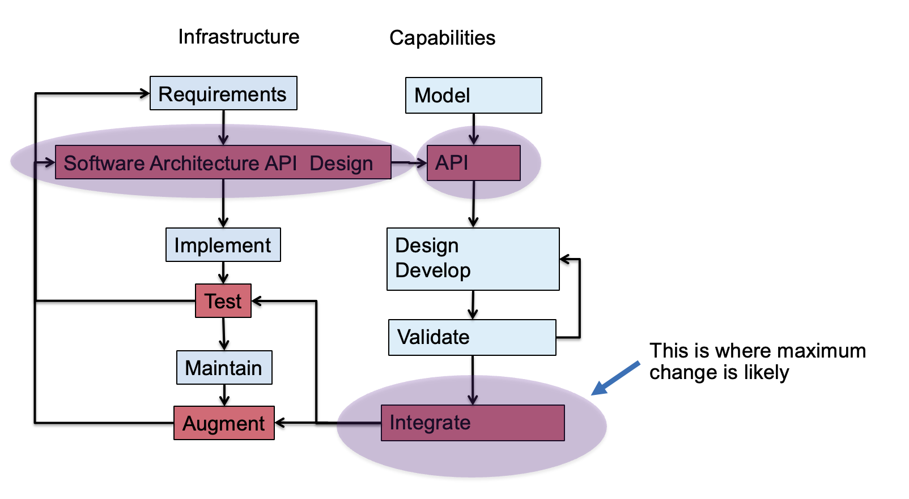
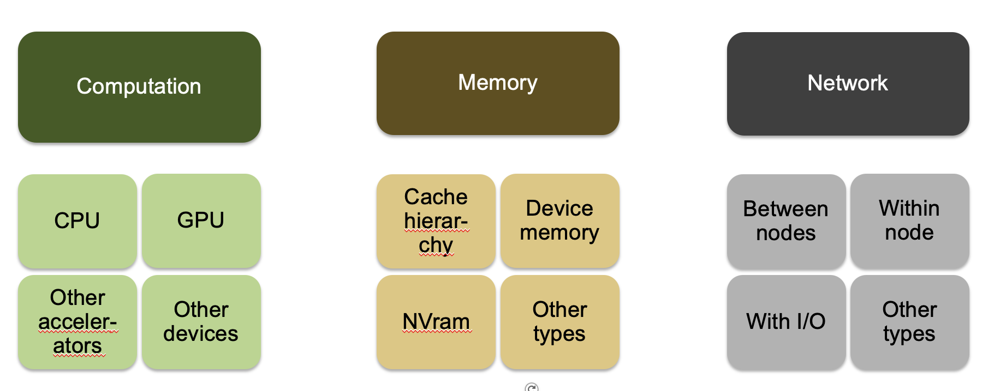

# New Paradigm Because of Platform Heterogeneity

Question \- do the design principles change?

The answer is – not really

The details get more involved

# Go Back to the Design Model for Separation of Concerns

# Platform Heterogeneity

And memory access models: unified memory / gpu\-direct / explicit transfer

