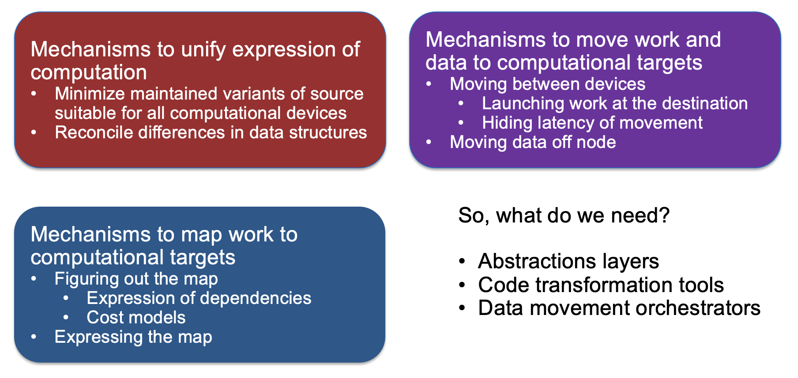
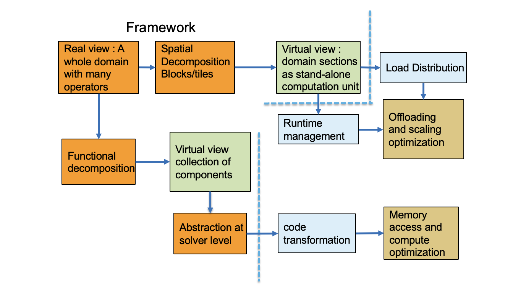
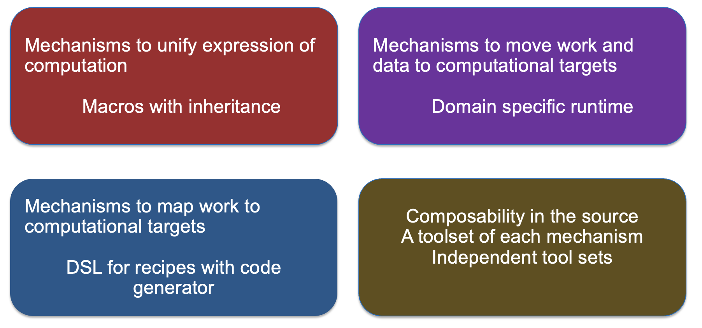

# Mechanisms Needed by the Code

# Underlying Ideas: Unification of Computational Expressions

__Make the same code work on different devices__

* _Same algorithm different data layouts or operation sequence:_
  * A way to let compiler know that ”this” expression can be specialized in many ways
  * Definition of specializations
  * Often done with template meta\-programming

* _More challenging if algorithms need to be fundamentally different_
  * Support for alternatives

# Underlying Ideas: Moving Work and Data to the Target

__Parallelization Models__

* __Hierarchy in domain decomposition__
  * Distributed memory model at node level – still very prevalent\, likely to remain so for a while
  * Also done with PGAS models – shared with locality being important

__Assigning work within the node__

“Parallel For” or directives with  unified memory

Directives or specific programming model for explicit data movement

_More complex data orchestration system for asynchronous computation_

Task based work distribution

# Underlying Ideas: Mapping Work to Targets

__This is how many abstraction layers work__

Infer the structure of the code

Infer the map between algorithms and devices

Infer the data movements

Map computations to devices

These are specified either through constructs or pragmas

__It can also be the end user who figures out the mapping__

__In either case performance depends upon how well the mapping is done__

# Features and Abstractions to be Added to Earlier Example

# Mechanisms Needed by the Code : Example Flash-X

# Construction of Application with Components and Tools

